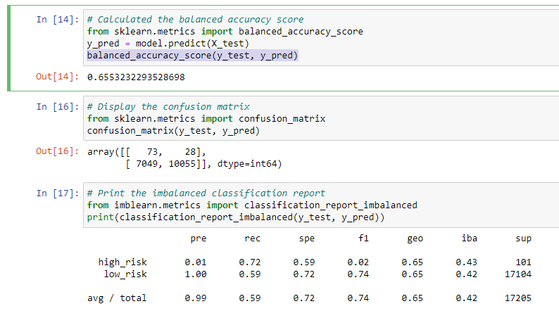
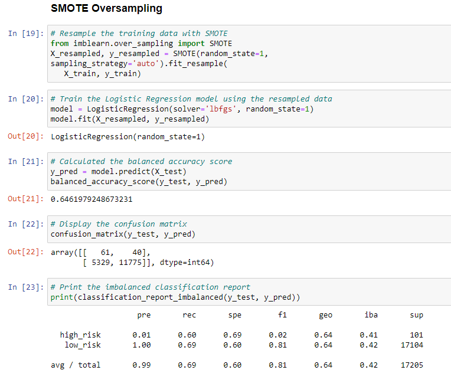
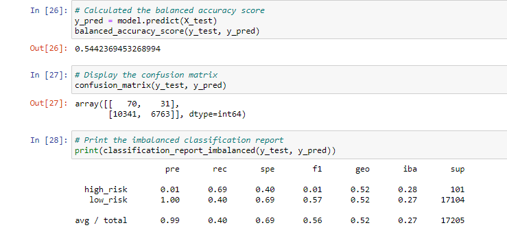
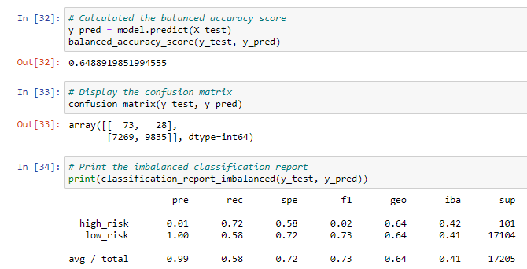
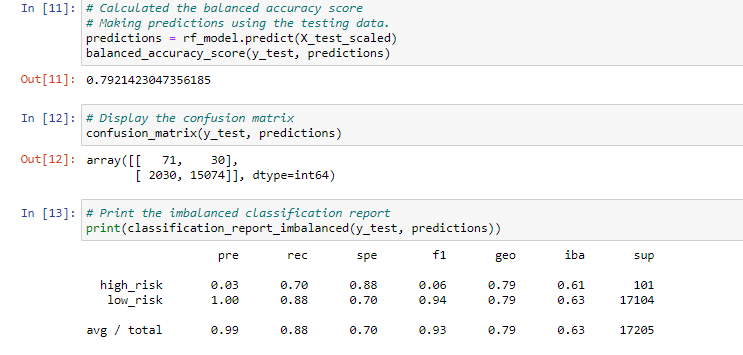
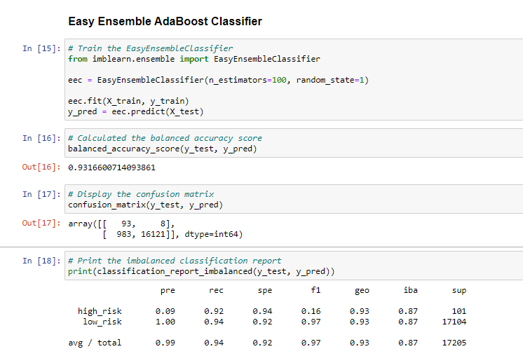

# Credit_Risk_Analysis

## Overview of the analysis:
The purpose of this analysis is to predict weather someone is at high or low risk credit status. We use python libraries such as scikit-learn to build and train machine learning models to predict credit risk. The results show the use of 6 different sampling models and the total/average accuracy and precision for each model for high and low risk clusters.

## Results

### 1. Naive Random Oversampling

The accuracy of this model was 65%, the precision was 99% and the recall was 59%.

### 2. SMOTE OverSampling

The accuracy of this model was 65%, the precision was 99% and the recall was 69%.

### 3. Undersampling

The accuracy of this model was 54%, the precision was 99% and the recall was 40%.

### 4. Combination

The accuracy of this model was 65%, the precision was 99% and the recall was 58%.

### 5. Balanced Random Forest Classifier

The accuracy of this model was 79%, the precision was 99% and the recall was 88%.

### 6. Easy Ensemble ADA Boost Classifier

The accuracy of this model was 93%, the precision was 99% and the recall was 94%.

## Summary
Among the models used in this study, it is clear that the ensemble methods are superior due to higher accuracy and recall. The Easy Ensemble method would be the model recommended to use for assessing credit risk because it has the best balance of accuracy and recall and has the highest f1 score for high and low risk. 

All of the models used are not precise in determining if credit risk is high as can be seen in the above screenshot but this is due to few data points in the data set that are classified as high credit risk. As can be seen in the confusion matrix, the true and false positive counts are significantly lower than the true and false negative counts.

